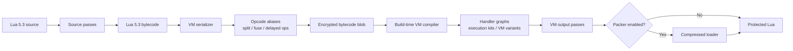
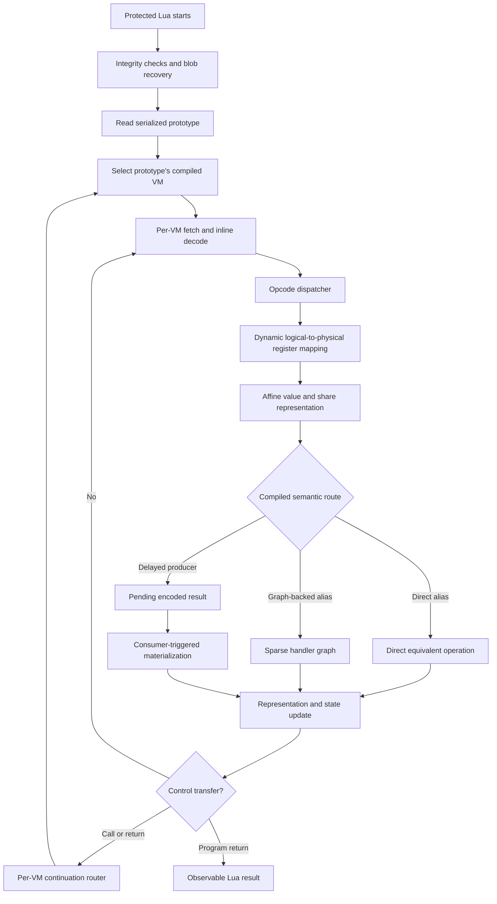
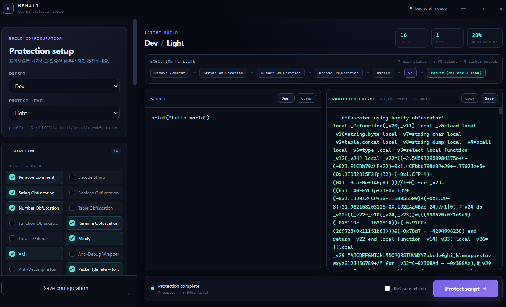

# Karity Obfuscator

Karity Obfuscator is a Lua 5.3 source obfuscator and custom bytecode VM designed to raise
the cost of static analysis, dynamic tracing, and generic devirtualization.

It combines conventional source transformations with opcode virtualization,
encoded value storage, dynamic register mapping, cross-instruction semantics,
runtime-polymorphic execution, and build-time diversification of hot VM paths.

> Obfuscation is a delay mechanism, not a mathematical guarantee. A determined
> analyst with full control of the runtime can eventually recover behavior.


## Quick start

```bash
pip install -r requirements.txt
cp config.example.json config.json
python main.py hello.lua --profile fast-vm
```

The result is written next to the input as `hello_obfuscated.lua`. Use `-o` to
choose another path.

On Windows, compatible Lua binaries are included in `bin/`. On other platforms,
install Lua 5.3 and `luac` 5.3 and make them available on `PATH`.

## Choose a profile

| Profile | Intended use | VM | Trade-off |
|---|---|---:|---|
| `dev` | Fast source-level iteration | No, by default | Fastest builds and easiest debugging |
| `fast-vm` | VM behavior checks and routine protected builds | Single lightweight VM | Moderate output and runtime cost |
| `max` | Release candidates requiring the full protection stack | Three diversified VMs | Largest output and longest build time |

```bash
python main.py input.lua --profile dev
python main.py input.lua --profile fast-vm
python main.py input.lua --profile max --release-check
```

The guiding performance rule is: **keep graph generation, execute heavy graphs
sparsely**. Complex handlers and variants are compiled at build time where
possible; runtime selection is reserved for paths where trace diversity is
worth the cost.

## Protection model

The selected profile controls which optional stages run and how aggressively
the VM stages are compiled.



At runtime, one instruction can take different equivalent routes depending on
its opcode alias, compiled VM, block variant, execution state, and configured
rates:



The diagrams show where a protection is applied, but not every instruction
uses every expensive path. Rates such as `graph_execution_rate`,
`cross_instruction_rate`, and `block_variant_rate` deliberately keep heavy
runtime work sparse.

### Source layer

- String, number, boolean, table, and identifier transformations
- Function control-flow flattening and opaque predicates
- Global localization, comment removal, and minification
- Anti-debug and anti-decompile source traps

### Virtual machine layer

- Randomized virtual opcode aliases and multiple dispatcher layouts
- Handler splitting, fusion, mutation, fake handlers, and junk instructions
- Multiple independently generated VM interpreters in one output
- Build-time compiled arithmetic, semantic, control-flow, and occurrence graphs
- Sparse per-site graph execution with state diffusion and cross-frame coupling

### Value and register layer

- Per-value affine encoding with additive share fragmentation
- Encoded representations for integers, booleans, nil, floats, strings, and references
- Representation rotation and encoded-domain `ADD`, `SUB`, and `UNM` paths
- Independent physical mappings for values, shares, epochs, types, and pending state
- Dynamic mapping rotation so logical registers do not retain stable physical locations

### Trace and semantic layer

- Consumer-triggered delayed materialization across instructions
- Per-execution rolling route state and runtime-polymorphic microtraces
- Runtime-selected physical variants of straight-line bytecode blocks
- Diverse table, upvalue, comparison, closure, and vararg handler implementations
- Per-VM fetch/decode, register-access, semantic, flow, and continuation-router kits
- Build-time call-site wiring instead of a single runtime helper selector

### Encryption and integrity

- Encrypted bytecode and constants
- Per-build instruction layouts and keystream variants
- Integrity constants, anti-tamper checks, and anti-dump mechanisms
- Optional compressed loader/packer

For every pass and VM option, see
[the generated configuration reference](docs/configuration.md).

## CLI usage

```bash
# Input and output
python main.py input.lua
python main.py input.lua -o protected.lua

# Profiles and one-off overrides
python main.py input.lua --profile fast-vm
python main.py input.lua --passes string_obf,number_obf,minify
python main.py input.lua --vm-option vm_count=2
python main.py input.lua --vm-option graph_execution_rate=0.05

# Inspection and diagnostics
python main.py --list-profiles
python main.py --list-passes
python main.py input.lua --profile fast-vm --print-config
python main.py input.lua -vv --profile-report build-profile.json

# Reproducible test build
python main.py input.lua --profile fast-vm --seed 1234

# Release validation
python main.py input.lua --profile max --release-check
```

`--seed` exists for reproducible testing. Do not use a fixed seed for release
artifacts. `--release-check` rejects reproducible seeds and weak release
settings before writing the output.

## GUI

```bash
python obfuscator_gui.py
```

The GUI exposes the same profile-based configuration used by the CLI.



Choose a complete build preset (`dev`, `fast-vm`, or `max`) or apply an
independent VM protection level (`Light` through `Maximum`). Every pass and VM
option can also be edited directly; manual changes automatically switch the
affected selector to `<Custom>`. VM controls are generated from the central
option registry so newly registered options stay in sync with the CLI.

## Configuration

Copy `config.example.json` to `config.json`, then adjust profiles instead of
editing pass lists for every build. CLI values supplied with `--vm-option`
override the selected profile for that invocation.

The most important performance controls are:

| Option | Effect |
|---|---|
| `graph_execution_rate` | How often heavy compiled handler graphs execute |
| `cross_instruction_rate` | Frequency of delayed cross-instruction materialization |
| `runtime_polymorphism_rate` | Frequency of runtime-selected microtrace recipes |
| `block_variant_rate` | Fraction of eligible blocks emitted with runtime variants |
| `helper_variant_count` | Number of build-time implementations for hot VM helpers |
| `helper_diversity_rate` | Fraction of call sites wired to non-baseline helper variants |
| `semantic_diversity_rate` | Fraction of eligible aliases using alternate semantic lowering |
| `vm_count` | Number of independent interpreters; strongly affects output and build size |

Start with `fast-vm`. Increase one family at a time and profile the protected
program's real workload. A high setting in every category is rarely the best
performance/security balance.

## Testing

Run the semantic suite against the currently selected config:

```bash
python test/run_test.py --profile dev
python test/run_test.py --profile fast-vm --jobs 4
python test/run_test.py 09_table 14_vm_call_machine
```

Focused regressions cover high-risk VM subsystems:

```bash
python test/run_number_obf_regression.py
python test/run_packer_regression.py
python test/run_runtime_poly_regression.py
python test/run_vm_choke_regression.py
python test/run_gui_regression.py
```

For a deterministic build during diagnosis, pass `--seed`. Compare the source
and protected program's exit code, stdout, and stderr; the main test runner does
this automatically.

## Repository layout

```text
obfuscator/passes/   source and output transformation passes
obfuscator/vm/       serializer, VM template, variants, and VM build pipeline
test/scripts/        Lua semantic fixtures
test/benchmarks/     repeatable runtime profiling workloads
test/run_*.py        semantic and subsystem regression runners
tools/               generated-document utilities
gui/web/             GUI frontend assets
```

Regenerate the option reference after changing the registry:

```bash
python tools/generate_config_docs.py
python tools/generate_config_docs.py --check
```

## Compatibility and limitations

- Input and VM semantics target Lua 5.3.
- Native modules and environment-dependent behavior remain properties of the
  host Lua runtime.
- Aggressive profiles increase build time, output size, startup time, and
  runtime overhead. Benchmark the actual application before release.
- Anti-debug and anti-tamper checks can conflict with instrumented or modified
  runtimes; test on the intended deployment environment.
- The VM increases analysis cost but cannot prevent observation by an attacker
  who fully controls execution.

## Preview


## License

Released under the [MIT License](LICENSE).

Use the project only on code you own or are authorized to protect and test.
