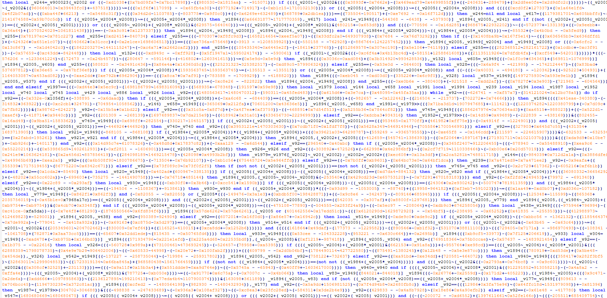
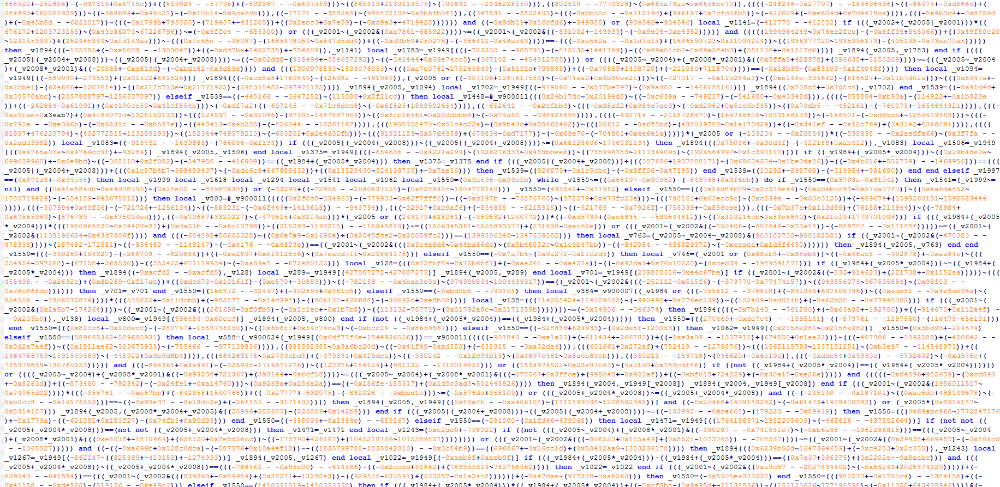
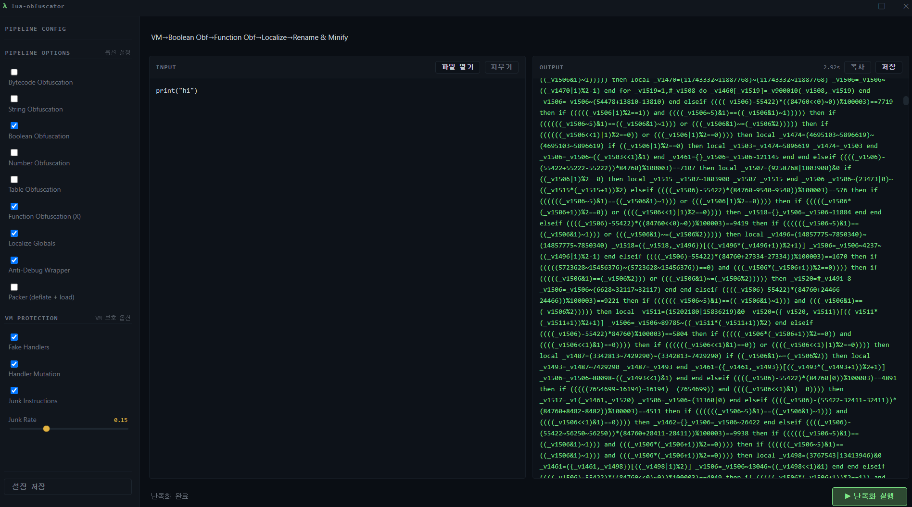

# karity obfuscator
a lua 5.3 obfuscator with a custom vm protection layer.


## quick start
```bash
pip install -r requirements.txt
cp config.example.json config.json
python main.py hello.lua
```

## features
**source protection**
- type-specific obfuscation
- control flow flattening and opaque predicates
- identifier obfuscation
- anti-debug and anti-decompile

**VM protection**
- custom Lua 5.3 virtual machine
- opcode virtualization and randomization
- build-time compiled handler graphs with liveness-aware state diffusion
- per-occurrence descriptors with runtime state and cross-frame coupling
- sparse state-keyed integer register representations
- sparse live-state sealing for jump, loop, iterator, and vararg control operands
- handler mutation
- multi-VM support

**encryption & integrity**
- bytecode and constant encryption
- anti-tamper and anti-dump
- runtime protection
- code packer

For a complete list of passes and configuration options, see
[`docs/configuration.md`](docs/configuration.md).

--------

## preview




## usage
```bash
# cli
python main.py input.lua
python main.py input.lua --profile fast-vm
python main.py input.lua --profile max
python main.py input.lua --passes string_obf,number_obf,minify
python main.py input.lua --vm-option vm_count=1 --vm-option junk_rate=0
python main.py input.lua -o output.lua
python main.py input.lua -v
python main.py input.lua -vv --profile-report build-profile.json
python main.py input.lua --profile max --release-check
python main.py input.lua --print-config
python main.py --list-profiles
python main.py --list-passes

# gui
python obfuscator_gui.py
```

The default `config.json` uses profiles so testing and release builds do not
require editing pass lists by hand:

- `dev`: fast source-level obfuscation for quick iteration
- `fast-vm`: lightweight VM build for VM behavior checks
- `max`: full protection preset for real use

`--seed` is intended for reproducible test builds. Use `--release-check` before
real builds; it rejects seeded builds and weak VM settings.

## testing
```bash
python test/run_test.py
python test/run_test.py --profile fast-vm 01 02
python test/run_test.py --profile max --jobs 2 --seed 1234
python test/run_test.py 01 02
python test/run_test.py func
```

## docs
```bash
python tools/generate_config_docs.py
python tools/generate_config_docs.py --check
```
