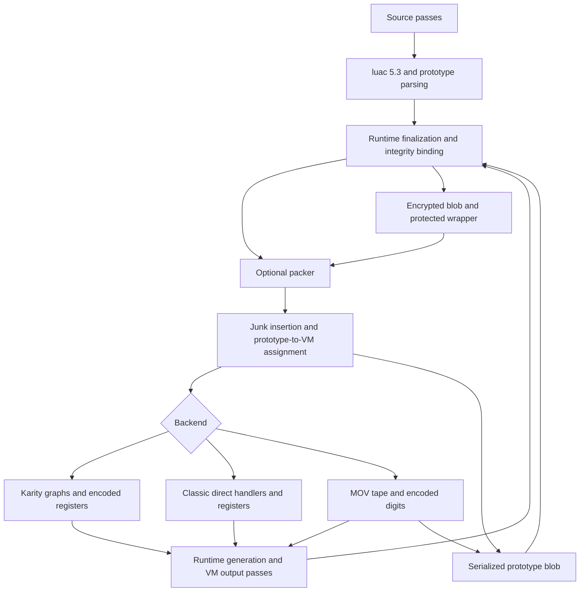
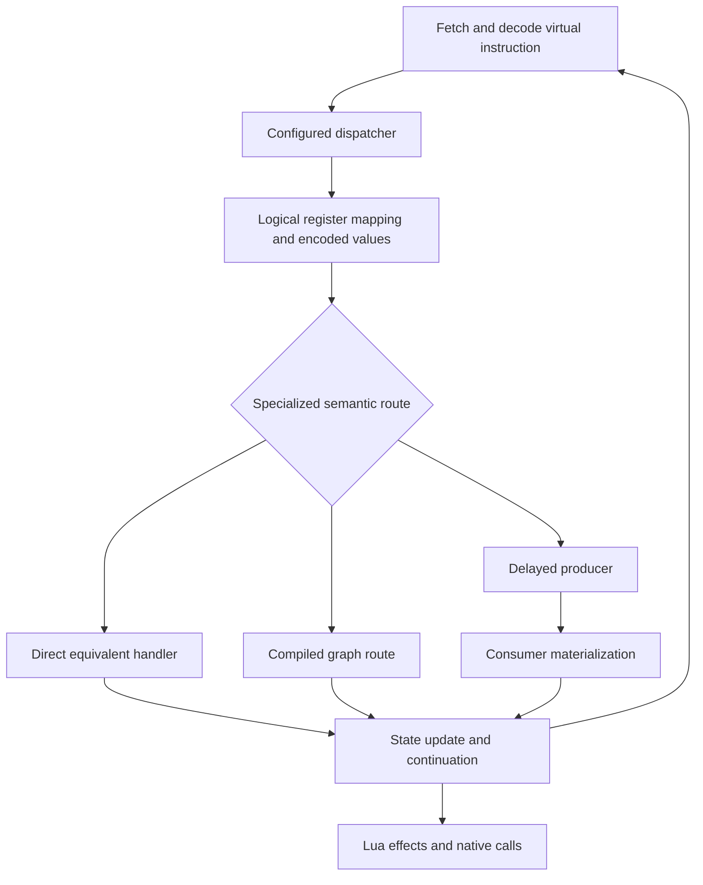
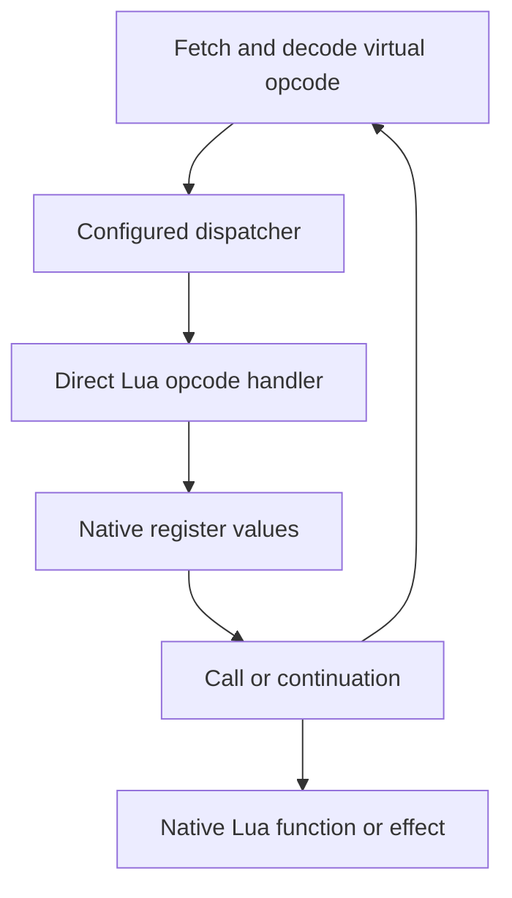
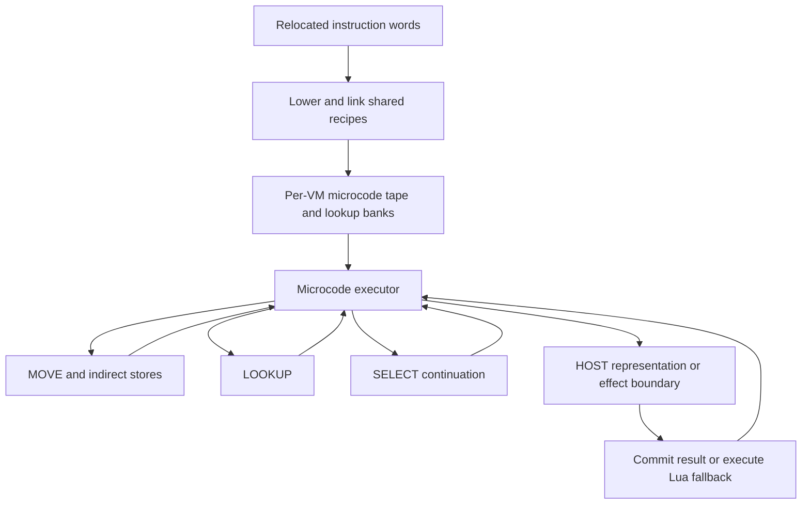

# VM backends

Karity, Classic and MOV consume the same Lua 5.3 bytecode and produce executable
Lua source. Select them with `--vm-option backend=karity|classic|mov` or the GUI.
An omitted backend and `backend=default` both select Karity. **Migration:** older
versions mapped `default` to Classic; specify `classic` to retain that behavior.
MOV is a supported release configuration with documented HOST boundaries; it is
not yet a complete MOV-only implementation.

## Shared pipeline and interface

`VMPass(vm_options=...)` normalizes the backend and delegates to `VMBuildPipeline`.
Its `run(script)` returns protected Lua; `last_profile` reports build phases.
All backends share compilation, prototype parsing, Semantic IR construction,
protection planning, VM assignment, junk insertion, integrity constants,
encrypted blob forms, and configured output passes. The backend declares its
capabilities and selects instruction lowering and runtime generation. Packing is
a separate outer pass and also works without a VM. See the
[IR architecture and migration map](vm-ir-architecture.md).

VM output passes run before the runtime is finalized for dump/integrity binding.
Changing that finalized function afterwards can invalidate the artifact. Each
prototype belongs to one generated VM; increasing `vm_count` diversifies runtimes,
not CPU parallelism. Source/output pass contexts and release rules are listed in
the [configuration reference](configuration.md).

## Karity

Karity supports graph execution, state threading, argument/upvalue/table/branch
virtualization, runtime polymorphism and helper diversity. Which routes actually
run depends on the enabled controls and eligible sites. Heavy graphs are compiled
at build time and selected sparsely at runtime. This backend still depends on Lua
for native calls and observable effects; it is not an isolation boundary.

## Classic

Classic retains opcode mapping, split/fused handlers, handler mutation and
configurable dispatchers on the shared packaging pipeline. It omits Karity's
encoded-register/graph execution and deferred producers. Direct arithmetic,
comparisons and object operations remain visible in host Lua handlers. It is a
useful simpler runtime for comparison and debugging, with fewer runtime layers.

## MOV

Each VM has independent micro-op IDs and digit encodings. Integer arithmetic,
floor division/modulo, bitwise operations and signed-count shifts use lookup
recipes. Numeric comparisons cover integer/float combinations; float negation
flips the sign through lookup. String length and all-string concatenation use
byte lists. String equality is locale independent; byte ordering is lowered only
under C/POSIX collation. Boolean tests and jumps select microcode continuations.

Encoded integers and strings can remain in registers until a native consumer
needs their Lua representation. HOST preparation/commit includes classification,
bitcasts and representation construction. Binary floating-point arithmetic,
coercions, metamethods, non-C string ordering and object/call semantics still use
Lua execution. Function-table indirection alone is not counted as MOV lowering.
Recipes are shared per VM; frames keep private scratch storage and continuations.
See the [detailed supported operations](configuration.md#vm) and implementation
in [mov](../obfuscator/vm/mov/).

## Supported controls

The table below is generated from `VM_OPTION_DOCS` and the same capability map
used by the GUI, CLI warnings and MOV profiling. ?No? means retained but ignored;
invalid option names, types and ranges remain validation errors. GUI controls
are disabled without discarding stored values. CLI warns once for supplied
unsupported controls, including values inherited from a profile.

<!-- BEGIN BACKEND OPTIONS -->

| Option | Karity | Classic | MOV |
|---|---|---|---|
| `backend` | Yes | Yes | Yes |
| `dispatcher_type` | Yes | Yes | No |
| `dispatcher_target_hiding` | Yes | Yes | No |
| `semantic_state_threading` | Yes | No | No |
| `argument_virtualization` | Yes | No | No |
| `upvalue_virtualization` | Yes | No | No |
| `table_virtualization` | Yes | No | No |
| `branch_virtualization` | Yes | No | No |
| `blob_form` | Yes | Yes | Yes |
| `vm_count` | Yes | Yes | Yes |
| `fake_handlers` | Yes | Yes | No |
| `mutate_handlers` | Yes | Yes | No |
| `junk_instructions` | Yes | Yes | Yes |
| `junk_rate` | Yes | Yes | Yes |
| `integrity_constants` | Yes | Yes | Yes |
| `integrity_constant_rate` | Yes | Yes | Yes |
| `graph_execution_rate` | Yes | No | No |
| `cross_instruction_rate` | Yes | No | No |
| `runtime_polymorphism_rate` | Yes | No | No |
| `runtime_trace` | Yes | No | No |
| `block_variant_rate` | Yes | No | No |
| `block_variant_count` | Yes | No | No |
| `block_variant_max_instructions` | Yes | No | No |
| `helper_variant_count` | Yes | No | No |
| `helper_diversity_rate` | Yes | No | No |
| `semantic_diversity_rate` | Yes | No | No |

<!-- END BACKEND OPTIONS -->

## Cost and protection differences

| Backend | Runtime and output cost | Protection characteristics |
|---|---|---|
| Karity | Graphs, variants and encoded state add build, memory and execution cost; rates strongly affect it | Diversified state-dependent routes and representations |
| Classic | Fewer runtime layers; shared output transforms and multiple VMs can still dominate size | Opcode/handler/dispatcher diversification with direct Lua operations |
| MOV | Many microinstructions, lookup banks and byte-list allocations can be expensive; recipes are shared | Encoded data and lookup-based lowered operations, with explicit HOST boundaries |

These are architectural trade-offs, not measured speed rankings or security
scores. Compare identical source, passes, seeds and VM counts on the intended
runtime. Use `fast-vm` for diagnosis and `high` for practical release settings;
`max` remains an experimental profile. `--release-check` validates the controls
that apply to the chosen backend, not a performance target or resistance proof.

## Verification

Run `python test/run_ci.py`. Backend tests exercise alias resolution, direct
Classic dispatchers, multi-VM execution and MOV lookup paths with native fallback
traps. Independent microcode checks validate shift/division behavior. The suite
also checks trace removal, generated docs, release configuration and packing.
